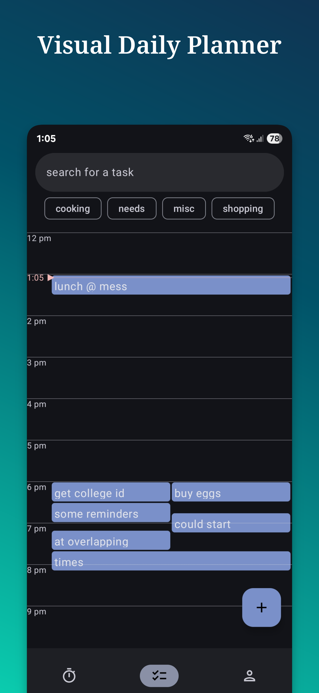
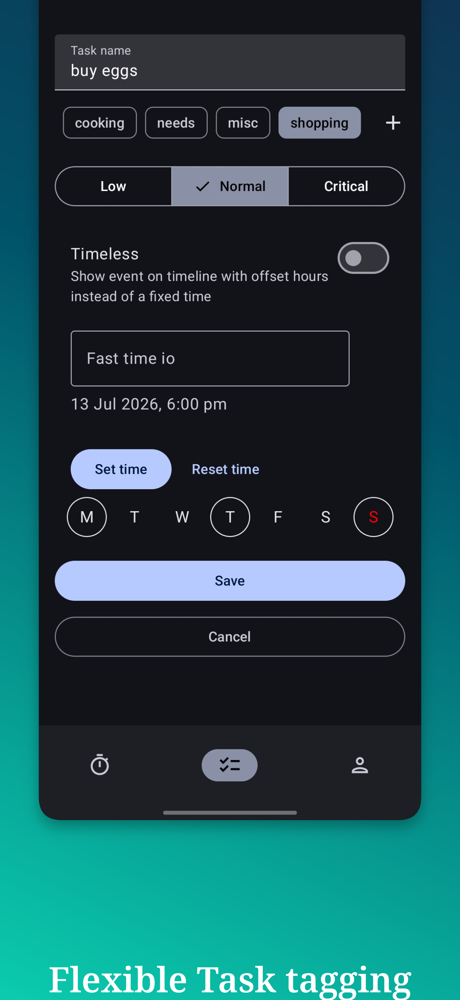
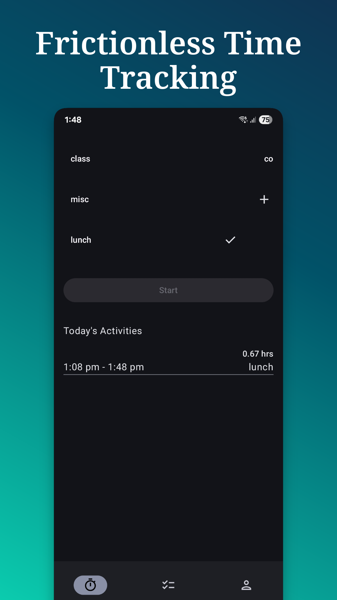
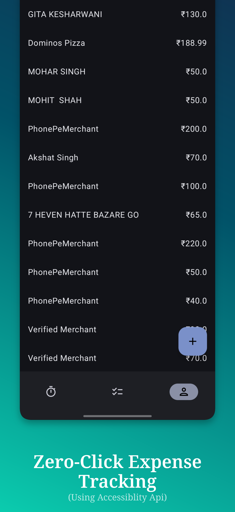

## 🦎 Salamander
Salamander is a hobby app, I develop in my free time. 
It's a local FOSS app for tracking your time, expenses & scheduling reminders

## Previews

  

### Features
Salamander has different set of features, any or all of which you can choose to use. 
All the features are currently local, app has no internet permission.
- Zero-Click Expense Tracking: Uses Accessibility API to see screen of Google Pay & Paytm, Logs transaction without needing to manually log them
- Frictionless Time Tracking: Track how you spend your time (& graph them!)
- Smart Reminders & Tasks: A robust event scheduling and notification system. Prioritize tasks (Low, Normal, Critical), assign custom tags, and manage overlapping events on a visual timeline. Powered by AlarmManager for reliable alerts.

## Tech Stack & Architecture
Developed with modern Android development practices and a clean architecture approach like:
- Jetpack Compose for seamless UI development
- Dependency Injection with Hilt
- Local Persistence with Room Database
- Navigation with Jetpack Navigation
- Background Processing: Accessibility API (Screen parsing) (currently only for Google Pay & Paytm package)
- AlarmManager for scheduling reminder notifications

## Privacy & Permissions Note

Payment tracking functionality utilizes the Android Accessibility Service permission. So its up to you to grant it. Other features will still work.
All Data is stored locally in room database (the app doesn't even have internet permission)

### Builds
where are the official builds?
well while you can clone the repo and build, the official builds will be available once I’m 'satisfied'
that includes adding features like:
- graphing of time tracking feature & ability to analyze multiple days / weeks / months visually
- cleaner UI for expense tracking, right now it's just a placeholder ui for proof of work (plus graphing the expenses)
- feature complete task scheduling (like deleted tasks, search, better zoom / scale support)
- more stuff to track, (like sleep) & interloop between features
